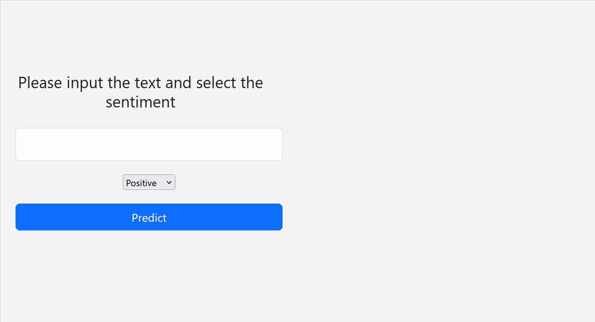

# Tweet_Sentiment_Extraction_using_Amazon_Sagemaker

In this project, I have tried to solve [Tweet Sentiment Extraction]("https://www.kaggle.com/competitions/tweet-sentiment-extraction/overview") Kaggle Problem.

  In `notebooks/01-DataPrep-and-training.ipynb`, I have used Amazon Sagemaker to train and deploy a `roberta` model on [Tweet Sentiment Extraction dataset](https://www.kaggle.com/competitions/tweet-sentiment-extraction/overview) dataset from kaggle. 
   Then in the notebook `02-Create-Lambda.pynb` I have showed how to create AWS Lambda required to host the Sagemaker Endpoint via API Gateway .

Pytorch and hugging face is used for the modeling purpose.

## Follow the steps as below.
1. Create a Sagemaker notebook instance with the instance type as `ml.t2.medium`
2. Once the Notebook instance is `In Service`, clone this git repo in the Jupyter environment
3. Run `notebooks/01-DataPrep-and-training.ipynb` notebook to train and deploy the model with Amazon Sagemaker followed by Inference
4. Refer to `src/train.py` script used for training the model
5. Run notebook `notebooks/02-Create-Lambda` to create AWS Lambda required to host the Sagemaker Endpoint via API Gateway
6. Follow this detailed [AWS tutorial]("https://aws.amazon.com/blogs/machine-learning/call-an-amazon-sagemaker-model-endpoint-using-amazon-api-gateway-and-aws-lambda/") to invoke lambda function via Amazon API gateway
7. Download `app` folder in your local and run `app/app.py` and change the variable `url = "<<Amazon API Gateway url link>>"` with your Amazon API Gateway url link  to create a flask API.
8. (Optional) You can follow this <a href = "https://medium.com/techfront/step-by-step-visual-guide-on-deploying-a-flask-application-on-aws-ec2-8e3e8b82c4f7">medium article</a> to run your Flask API on AWS EC2 instance.

## Demo

## Authors

- [@Ravishukla1234](https://www.github.com/Ravishukla1234)

## License

This library is licensed under the Apahce License 2.0. See the LICENSE file.
